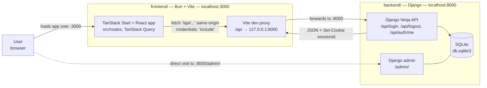

# Project PulsePM frontend

The frontend is a strict TypeScript application built with React, TanStack Start, Vite, Tailwind CSS, and TanStack Query. Bun manages packages and runs scripts; Biome provides formatting and linting.

## Prerequisites

- [Bun](https://bun.sh/docs/installation)

## Setup and development

Prefer the root project commands:

```sh
make install-frontend
make dev-frontend
```

The development server is available at http://localhost:3000. For direct frontend work, run `bun install` and `bun run dev` from this directory.

## Networking

The browser only ever talks to the Vite dev server on port 3000. API calls are made to the
same-origin path `/api/*` and forwarded to Django by the Vite proxy configured in
`vite.config.ts`, so no CORS configuration is needed and the Django `sessionid` cookie is
treated as first-party.



- The user loads the app from the frontend on http://localhost:3000.
- `src/lib/auth-api.ts` sends every request to `/api/...` with `credentials: 'include'`.
- Vite proxies those requests to Django at http://127.0.0.1:8000, which serves the Ninja API
  under `/api/` and authenticates with standard Django sessions.
- Django admin at http://localhost:8000/admin/ is reached directly, bypassing the frontend.

## Quality commands

From the repository root:

```sh
make lint-frontend
make format-frontend
make typecheck-frontend
make test-frontend
make check-frontend
```

Production assets can be verified with `bun run --cwd frontend build`.

Routes live in `src/routes`; `src/routeTree.gen.ts` is generated and should not be edited manually. Shared browser/server data access belongs in the existing TanStack Query integration.
